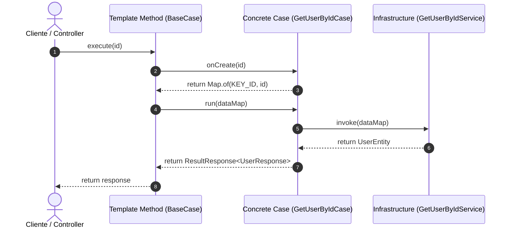
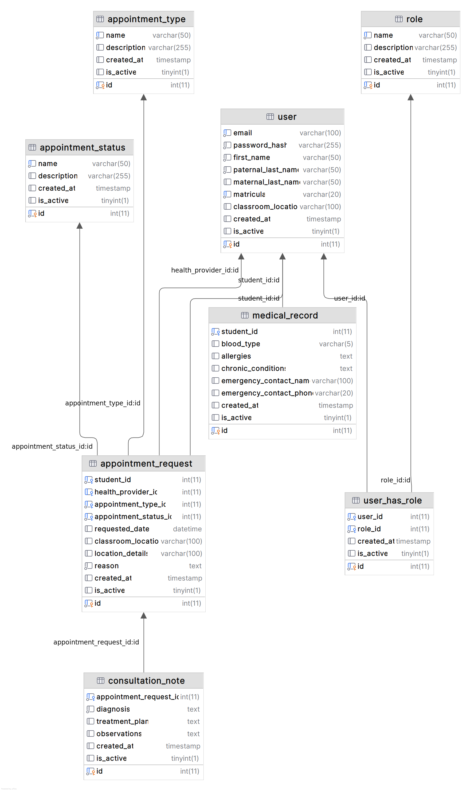

# Sistema de Gestión de Citas (SGC)

**Tabla de Contenidos**

* [Requisitos del Sistema](https://www.google.com/search?q=%23requisitos-del-sistema)
* [Arquitectura del Software](https://www.google.com/search?q=%23arquitectura-del-software)
* [Modelo en Capas y Clean Architecture](https://www.google.com/search?q=%23modelo-en-capas-y-clean-architecture)
* [Principios de la Programación Orientada a Objetos (OOP)](https://www.google.com/search?q=%23principios-de-la-programaci%C3%B3n-orientada-a-objetos-oop-en-la-arquitectura)
* [Configuración de Base de Datos](https://www.google.com/search?q=%23configuraci%C3%B3n-de-base-de-datos)
* [Diagrama Entidad-Relación](https://www.google.com/search?q=%23diagrama-entidad-relaci%C3%B3n)

---

## Requisitos del Sistema

* **Java:** Versión 26
* **Spring Boot:** Versión 4
* **Base de Datos:** MariaDB

---

## Arquitectura del Software

Este proyecto implementa una **Arquitectura en Capas** estructurada de forma modular y **orientada a casos de uso**. Su diseño garantiza la **seguridad ante concurrencia (Thread-Safety)** en un entorno multihilo mediante el uso de componentes **apátridas (*Stateless*)**, aislando la lógica de negocio y asegurando mantenibilidad, flexibilidad y alta cohesión.

### Flujo de Ejecución del Prototipo

El backend procesa las solicitudes HTTP siguiendo un flujo estandarizado a través de clases abstractas base (`BaseController`, `BaseCase`, `BaseService`). Las peticiones entran por el método ejecutor `execute(TRequest request)`, se transforman a un contexto apátrida `Map<String, Object>` en `onCreate(...)` y fluyen de forma aislada a través de `run(Map<String, Object>)` e `invoke(Map<String, Object>)`, asegurando aislamiento total por hilo:



---

## Modelo en Capas y Clean Architecture

El proyecto organiza sus paquetes bajo el directorio `edy.app.sgc.arch` reflejando las capas concéntricas del modelo:

1. **Presentación (`edy.app.sgc.arch.application`):**

* Capa externa encargada de exponer los puntos de entrada mediante controladores REST (`UserController` heredando de `BaseController`).
* Recibe solicitudes y las delega invocando `execute(request)`, transformando los resultados en objetos `ResponseEntity`.

2. **Aplicación / Casos de Uso (`edy.app.sgc.arch.domain.usecase`):**

* Contiene la lógica de negocio específica y secuencial de la aplicación (`GetUserByIdCase`, `GetAllUserCase`, heredando de `BaseCase<TRequest, TResponse>`).
* Orquesta las reglas del sistema de forma apátrida (*Stateless*) transformando la entrada en un mapa de contexto seguro mediante `onCreate(...)`.

3. **Dominio (`edy.app.sgc.arch.domain`):**

* El núcleo central que define las estructuras de respuesta, constantes de claves (`AppConstant`), configuraciones de lenguaje y DTOs (`ResultResponse`, `UserResponse`, `StudentIndexResponse`).

4. **Infraestructura (`edy.app.sgc.arch.infrastructure`):**

* Capa responsable de la persistencia y la conexión con la base de datos mediante JPA/Hibernate y `EntityManager` (`GetUserByIdService`, `GetAllStudentService` heredando de `BaseService<TOutput>`).

### Patrones de Diseño Implementados

* **Command (Comando):** Encapsula cada operación de negocio dentro de la llamada unificada `execute(TRequest)`.
* **Template Method:** Implementado en `BaseCase` para definir el esqueleto inmutable del flujo (`execute` llama internamente a `onCreate` y luego a `run`), permitiendo a cada caso de uso concretar la validación y ejecución.
* **Data Transfer Object (DTO):** Objetos como `ResultResponse`, `UserResponse` y `StudentIndexResponse` transportan la información sin exponer directamente las entidades JPA.
* **Data Mapper:** Uso de `ModelMapper` y transformaciones con Java Streams para mapear entidades relacionales a DTOs de salida.
* **Repository / DAO:** Componentes anotados con `@Repository` que abstraen las consultas JPQL con `EntityManager`.
* **Inyección de Dependencias:** Gestionada nativamente por Spring Boot mediante `@RequiredArgsConstructor` de Lombok.

---

## Principios de la Programación Orientada a Objetos (OOP) en la Arquitectura

Para estandarizar el comportamiento del sistema y garantizar la **seguridad frente a hilos concurrentes**, la arquitectura implementa principios de la OOP mediante clases abstractas base genéricas.

### 1. Abstracción y Diseño Apátrida (*Stateless*): Clases Base (`BaseCase` y `BaseService`)

La abstracción permite definir un contrato de procesamiento estandarizado donde la información viaja únicamente como variables de pila (*Stack*) en forma de `Map<String, Object>`.

* **Contrato Base de Casos de Uso (`BaseCase`):**
  Acepta tipos genéricos para la solicitud inicial (`TRequest`) y la respuesta (`TResponse`), estructurando el pipeline de ejecución:

```java
public abstract class BaseCase<TRequest, TResponse> {

    public ResultResponse<TResponse> execute(TRequest request) {
        var dataRequest = this.onCreate(request);
        return this.run(dataRequest);
    }

    protected abstract Map<String, Object> onCreate(TRequest request);

    protected abstract ResultResponse<TResponse> run(Map<String, Object> request);

}

```

* **Contrato Base de Infraestructura (`BaseService`):**
  Garantiza un punto de entrada único para el acceso a datos basado en mapas de parámetros:

```java
public abstract class BaseService<TOutput> {

    public abstract TOutput invoke(Map<String, Object> data);

}

```

### 2. Patrón de Diseño: *Template Method* y Encapsulamiento

El método `execute(...)` de la clase `BaseCase` actúa como el **Template Method** principal. Las subclases implementan `onCreate(...)` para validar y empaquetar los parámetros en un `Map<String, Object>`, y `run(...)` para ejecutar la lógica de negocio aislada:

```java
@Service
@RequiredArgsConstructor
public class GetUserByIdCase extends BaseCase<Long, UserResponse> {

    private final LangConfig lang;
    private final ModelMapper dto;
    private final GetUserByIdService service;

    @Override
    protected Map<String, Object> onCreate(Long id) {
        if (id == null || id <= 0) {
            throw new ValidationException(lang.get("user.id.invalid"));
        }

        return Map.of(AppConstant.KEY_ID, id);
    }

    @Override
    protected ResultResponse<UserResponse> run(Map<String, Object> request) {
        var dbResponse = service.invoke(request);

        if (dbResponse == null) {
            return new ResultResponse<>(
                HttpStatus.NO_CONTENT,
                lang.get("user.not_found"),
                null
            );
        }

        return new ResultResponse<>(
            HttpStatus.OK,
            HttpStatus.OK.getReasonPhrase(),
            dto.map(dbResponse, UserResponse.class)
        );
    }
}

```

### 3. Polimorfismo y Desacoplamiento en la Capa de Infraestructura

Las clases de servicio en la infraestructura extienden de `BaseService<TOutput>`, permitiendo que el caso de uso ejecute la persistencia llamando a `service.invoke(request)` sin preocuparse de los detalles técnicos de `EntityManager` ni de JPQL:

```java
@Repository
public class GetUserByIdService extends BaseService<UserEntity> {

    @PersistenceContext
    private EntityManager connection;

    @Override
    public UserEntity invoke(Map<String, Object> data) {
        try {
            String jpql = """
                SELECT u 
                FROM UserEntity u 
                LEFT JOIN FETCH u.medicalRecord 
                WHERE u.id = :id
            """;

            var record = connection.createQuery(jpql, UserEntity.class)
                .setParameter("id", data.get(AppConstant.KEY_ID))
                .getResultStream()
                .findFirst();

            return record.orElse(null);
        } catch (Exception e) {
            return null;
        }
    }
}

```

---

## Configuración de Base de Datos

Para levantar y poblar la base de datos de manera correcta en tu instancia de MariaDB, ejecuta los scripts SQL en el siguiente orden estricto desde tu gestor de base de datos preferido:

1. Ejecutar el script principal de estructura y esquemas iniciales: `database/sgc.v1.sql`
2. Ejecutar el script secundario de actualizaciones o procedimientos (como el cambio de visibilidad de usuarios): `database/user_change_visibility.sql`

---

## Diagrama Entidad-Relación

El diseño relacional detallado del sistema se encuentra representado en el diagrama de base de datos del repositorio:

* **Visualización del Diagrama:**



