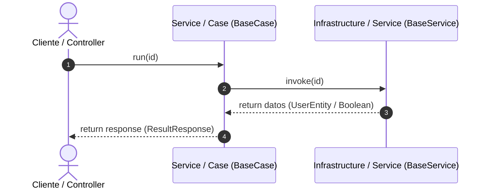

# Sistema de Gestión de Citas (SGC)

**Tabla de Contenidos**

* [Requisitos del Sistema](https://www.google.com/search?q=%23requisitos-del-sistema)
* [Arquitectura del Software](https://www.google.com/search?q=%23arquitectura-del-software)
* [Modelo en Capas y Clean Architecture](https://www.google.com/search?q=%23modelo-en-capas-y-clean-architecture)
* [Principios de la Programación Orientada a Objetos (OOP)](https://www.google.com/search?q=%23principios-de-la-programaci%C3%B3n-orientada-a-objetos-oop-en-la-arquitectura)
* [Configuración de Base de Datos](https://www.google.com/search?q=%23configuraci%C3%B3n-de-base-de-datos)
* [Diagrama Entidad-Relación](https://www.google.com/search?q=%23diagrama-entidad-relaci%C3%B3n)

---

## Requisitos del Sistema

* **Java:** Versión 26
* **Spring Boot:** Versión 4
* **Base de Datos:** MariaDB

---

## Arquitectura del Software

Este proyecto implementa una **Arquitectura en Capas** estructurada de forma modular y **orientada a casos de uso**. Su diseño garantiza la **seguridad ante concurrencia (Thread-Safety)** en un entorno multihilo mediante el uso de componentes **apátridas (*Stateless*)**, aislando la lógica de negocio y asegurando mantenibilidad, flexibilidad y alta cohesión.

### Flujo de Ejecución del Prototipo

El backend procesa las solicitudes HTTP siguiendo un flujo estandarizado a través de clases abstractas base (`BaseController`, `BaseCase`, `BaseService`). Los parámetros viajan de forma segura como argumentos directos en cada llamada a método (`run(request)` e `invoke(data)`), eliminando variables de instancia mutables en componentes Singleton:



---

## Modelo en Capas y Clean Architecture

El proyecto organiza sus paquetes bajo el directorio `edy.app.sgc.arch` reflejando las capas concéntricas del modelo:

1. **Presentación (`edy.app.sgc.arch.application`):**

* Capa externa encargada de exponer los puntos de entrada mediante controladores REST (`UserController` heredando de `BaseController`).
* Gestiona la comunicación directa con el cliente transformando los resultados en objetos `ResponseEntity`.

2. **Aplicación / Casos de Uso (`edy.app.sgc.arch.domain.usecase`):**

* Contiene la lógica de negocio específica y secuencial de la aplicación (`GetUserByIdCase`, `GetAllUserCase`, etc., heredando de `BaseCase`).
* Orquesta las reglas del sistema de forma apátrida (*Stateless*) e independiente a los frameworks web.

3. **Dominio (`edy.app.sgc.arch.domain`):**

* El núcleo central que define las estructuras de respuesta, códigos de estado, configuraciones de lenguaje y objetos de transferencia de datos (`ResultResponse`, `UserResponse`, `StudentIndexResponse`).

4. **Infraestructura (`edy.app.sgc.arch.infrastructure`):**

* La capa más externa responsable de la persistencia y la conexión con la base de datos mediante JPA/Hibernate, `EntityManager` y `JdbcTemplate` (`GetUserByIdService`, `UserChangeVisibilityService` heredando de `BaseService`).

### Patrones de Diseño Implementados

* **Command (Comando):** Cada caso de uso y servicio encapsula una operación única de negocio mediante el contrato de ejecución genérica `run(TInput)` e `invoke(TInput)`.
* **Template Method:** Empleado en `BaseCase` y `BaseService` para estandarizar el esqueleto de ejecución de las operaciones de negocio y consultas a base de datos.
* **Data Transfer Object (DTO):** Implementado en `ResultResponse`, `UserResponse` y `StudentIndexResponse` para transportar información de manera segura sin exponer las entidades de base de datos (`UserEntity`).
* **Data Mapper:** Uso de `ModelMapper` y transformaciones manuales en Java Streams para convertir entidades ORM a objetos de respuesta.
* **Repository / DAO:** Clases anotadas con `@Repository` que encapsulan las consultas JPQL y ejecuciones de funciones/procedimientos SQL.
* **Inyección de Dependencias:** Gestionada nativamente por Spring Boot mediante `@RequiredArgsConstructor` de Lombok.

---

## Principios de la Programación Orientada a Objetos (OOP) en la Arquitectura

Para estandarizar el comportamiento del sistema y garantizar la **seguridad frente a hilos concurrentes**, la arquitectura implementa principios de la OOP (como la **Abstracción**, la **Herencia**, el **Encapsulamiento** y el **Polimorfismo**) a través de clases abstractas base genéricas.

### 1. Abstracción y Diseño Apátrida (*Stateless*): Clases Base (`BaseCase` y `BaseService`)

La abstracción permite definir contratos generales ocultando los detalles de implementación específicos. Para evitar **condiciones de carrera (*Race Conditions*)**, se eliminaron las variables con `@Setter` de las clases base, convirtiéndolas en métodos ejecutores puros.

* **Aplicación en Casos de Uso (`BaseCase`):**
  Define un comportamiento genérico para manejar entradas (`TInput`) y salidas (`TOutput`), obligando a las clases hijas a implementar la lógica de negocio en el método `run(TInput request)` recibiendo el parámetro por argumento.

```java
public abstract class BaseCase<TInput, TOutput> {

    public abstract ResultResponse<TOutput> run(TInput request);

}

```

* **Aplicación en Servicios de Datos (`BaseService`):**
  Establece un contrato base para cualquier servicio de infraestructura encargado de interactuar con la base de datos de forma *Stateless*, exigiendo la implementación del método `invoke(TInput data)`.

```java
public abstract class BaseService<TInput, TOutput> {

    public abstract TOutput invoke(TInput data);

}

```

### 2. Patrón de Diseño: *Template Method* y Encapsulamiento

El patrón *Template Method* se encarga de definir el esqueleto de un algoritmo en una superclase, permitiendo que las subclases redefinan ciertos pasos sin cambiar su estructura general.

Junto con el **Encapsulamiento**, las variables de estado en los servicios Singleton se eliminaron para evitar la corrupción de datos en peticiones HTTP simultáneas:

```java
@Slf4j
@Service
@RequiredArgsConstructor
public class UserChangeVisibilityCase extends BaseCase<Long, Boolean> {

    private final LangConfig lang;
    private final UserChangeVisibilityService service;

    @Override
    public ResultResponse<Boolean> run(Long request) {
        log.info("Valor del request : {}", request);

        if (request == null || request <= 0) {
            return new ResultResponse<>(
                HttpStatus.BAD_REQUEST,
                lang.get("user.id.invalid"),
                false
            );
        }

        Boolean dbResponse = service.invoke(request);

        return new ResultResponse<>(
            HttpStatus.OK,
            dbResponse ? lang.get("user.change_visibility.success") : lang.get("user.change_visibility.error"),
            dbResponse
        );
    }
}

```

### 3. Polimorfismo y Desacoplamiento en la Capa de Infraestructura

Gracias a que `UserChangeVisibilityService` extiende de `BaseService<Long, Boolean>`, el caso de uso puede invocar el método `invoke(request)` de manera polimórfica sin necesidad de conocer la ejecución SQL o transaccional subyacente de `JdbcTemplate`:

```java
@Repository
@RequiredArgsConstructor
public class UserChangeVisibilityService extends BaseService<Long, Boolean> {

  private final JdbcTemplate connection;
  private final TransactionTemplate transaction;

  @Override
  public Boolean invoke(Long id) {
    return transaction.execute(status -> {
      try {
        String sql = """
                    SELECT user_change_visibility(?)
                """;

        return connection.queryForObject(sql, Boolean.class, id);
      } catch (Exception e) {
        status.setRollbackOnly();
        return false;
      }
    });
  }
}

```

---

## Configuración de Base de Datos

Para levantar y poblar la base de datos de manera correcta en tu instancia de MariaDB, ejecuta los scripts SQL en el siguiente orden estricto desde tu gestor de base de datos preferido:

1. Ejecutar el script principal de estructura y esquemas iniciales: `database/sgc.v1.sql`
2. Ejecutar el script secundario de actualizaciones o procedimientos (como el cambio de visibilidad de usuarios): `database/user_change_visibility.sql`

---

## Diagrama Entidad-Relación

El diseño relacional detallado del sistema se encuentra representado en el diagrama de base de datos del repositorio:

* **Visualización del Diagrama:**


