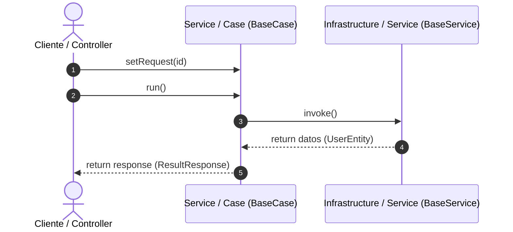

# Sistema de Gestión de Citas (SGC)

**Tabla de Contenidos**

* [Requisitos del Sistema](https://www.google.com/search?q=%23requisitos-del-sistema)
* [Arquitectura del Software](https://www.google.com/search?q=%23arquitectura-del-software)
* [Modelo en Capas y Clean Architecture](https://www.google.com/search?q=%23modelo-en-capas-y-clean-architecture)
* [Principios de la Programación Orientada a Objetos (OOP)](https://www.google.com/search?q=%23principios-de-la-programaci%C3%B3n-orientada-a-objetos-oop-en-la-arquitectura)
* [Configuración de Base de Datos](https://www.google.com/search?q=%23configuraci%C3%B3n-de-base-de-datos)
* [Diagrama Entidad-Relación](https://www.google.com/search?q=%23diagrama-entidad-relaci%C3%B3n)

---

## Requisitos del Sistema

* **Java:** Versión 26
* **Spring Boot:** Versión 4
* **Base de Datos:** MariaDB

---

## Arquitectura del Software

Este proyecto implementa una **Arquitectura en Capas** bajo los principios de **Clean Architecture**, estructurada de forma modular y **orientada a casos de uso**. Su diseño aísla la lógica de negocio central frente a frameworks, librerías y detalles de infraestructura, garantizando flexibilidad, mantenibilidad y una alta cohesión en el código.

### Flujo de Ejecución del Prototipo

El backend procesa las solicitudes HTTP siguiendo un flujo estandarizado a través de clases abstractas base (`BaseController`, `BaseCase`, `BaseService`), utilizando una interfaz fluida mediante los métodos `setRequest()`, `run()` e `invoke()`:



---

## Modelo en Capas y Clean Architecture

El proyecto organiza sus paquetes bajo el directorio `edy.app.sgc.arch` reflejando las capas concéntricas del modelo:

1. **Presentación (`edy.app.sgc.arch.application`):**
* Capa externa encargada de exponer los puntos de entrada mediante controladores REST (`UserController` heredando de `BaseController`).
* Gestiona la comunicación directa con el cliente transformando los resultados en objetos `ResponseEntity`.


2. **Aplicación / Casos de Uso (`edy.app.sgc.arch.domain.usecase`):**
* Contiene la lógica de negocio específica y secuencial de la aplicación (`GetUserByIdCase`, `GetAllUserCase`, etc., heredando de `BaseCase`).
* Orquesta las reglas del sistema de forma completamente independiente a los frameworks web.


3. **Dominio (`edy.app.sgc.arch.domain`):**
* El núcleo central que define las estructuras de respuesta, códigos de estado, configuraciones de lenguaje y objetos de transferencia de datos (`ResultResponse`, `UserResponse`).


4. **Infraestructura (`edy.app.sgc.arch.infrastructure`):**
* La capa más externa responsable de la persistencia y la conexión con la base de datos mediante JPA/Hibernate y `EntityManager` (`GetUserByIdService` heredando de `BaseService`).


### Patrones de Diseño Implementados

* **Template Method:** Empleado en `BaseCase` y `BaseService` para estandarizar el esqueleto de ejecución de las operaciones de negocio y consultas.
* **Fluent Interface (Interfaz Fluida):** Utilizado en los casos de uso para permitir el encadenamiento de métodos del tipo `getUserByIdCase.setRequest(id).run()`.
* **Inyección de Dependencias:** Gestionada nativamente por Spring Boot mediante `@RequiredArgsConstructor`.

---

## Principios de la Programación Orientada a Objetos (OOP) en la Arquitectura

Para estandarizar el comportamiento del sistema y evitar la duplicación de código, la arquitectura implementa diversos principios de la OOP (como la **Herencia**, el **Polimorfismo** y la **Abstracción**) a través de clases abstractas base y el patrón de diseño **Template Method**.

### 1. Abstracción y Herencia: Clases Base (`BaseCase` y `BaseService`)

La abstracción permite definir contratos generales ocultando los detalles de implementación específicos. En este proyecto se crearon clases base abstractas que definen el esqueleto de ejecución para los casos de uso y los servicios de infraestructura.

* **Aplicación en Casos de Uso (`BaseCase`):**
  Define un comportamiento genérico para manejar entradas (`TInput`) y salidas (`TOutput`), estableciendo un método de asignación fluida (`setRequest`) y obligando a las clases hijas a implementar la lógica de negocio en el método `run()`.

```java
public abstract class BaseCase<TInput, TOutput> {

    protected TInput request;

    public BaseCase<TInput, TOutput> setRequest(TInput request){
        this.request = request;
        return this;
    }

    public abstract ResultResponse<TOutput> run();

}

```

* **Aplicación en Servicios de Datos (`BaseService`):**
  Establece un contrato base para cualquier servicio de infraestructura encargado de interactuar con la base de datos, exigiendo la implementación del método `invoke()`.

```java
public abstract class BaseService<TOutput> {

    public abstract TOutput invoke();

}

```

### 2. Patrón de Diseño: *Template Method*

El patrón *Template Method* se encarga de definir el esqueleto de un algoritmo en una superclase, permitiendo que las subclases redefinan ciertos pasos del algoritmo sin cambiar su estructura general.

En el código, esto se observa claramente al momento de ejecutar una consulta específica como `GetUserByIdCase`. La clase base provee la estructura de entrada/salida, mientras que la clase concreta implementa su propia regla de negocio utilizando los componentes inyectados:

```java
@Service
@RequiredArgsConstructor
public class GetUserByIdCase extends BaseCase<Long, UserResponse> {

    private final LangConfig lang;
    private final ModelMapper dto;
    private final GetUserByIdService service;

    @Override
    public ResultResponse<UserResponse> run() {
        if (request == null || request <= 0){
            return new ResultResponse<>(HttpStatus.BAD_REQUEST, lang.get("user.id.invalid"), null);
        }

        service.setId(request);
        var dbResponse = service.invoke(); // Polimorfismo en acción

        if (dbResponse == null){
            return new ResultResponse<>(HttpStatus.NO_CONTENT, lang.get("user.not_found"), null);
        }

        return new ResultResponse<>(
            HttpStatus.OK,
            HttpStatus.OK.getReasonPhrase(),
            dto.map(dbResponse, UserResponse.class)
        );
    }
}

```

### 3. Polimorfismo y Desacoplamiento en la Capa de Infraestructura

Gracias a que `GetUserByIdService` extiende de `BaseService<UserEntity>`, el caso de uso puede invocar el método `invoke()` de manera polimórfica sin necesidad de conocer los detalles de la consulta JPQL subyacente que se ejecuta mediante el `EntityManager`:

```java
@Repository
public class GetUserByIdService extends BaseService<UserEntity> {

    @PersistenceContext
    private EntityManager connection;

    @Setter
    private Long id;

    @Override
    public UserEntity invoke() {
        try {
            String jpql = """
                SELECT u 
                FROM UserEntity u 
                LEFT JOIN FETCH u.medicalRecord 
                WHERE u.id = :id
            """;

            var record = connection.createQuery(jpql, UserEntity.class)
                .setParameter("id", id)
                .getResultStream()
                .findFirst();

            return record.orElse(null);
        } catch (Exception e) {
            return null;
        }
    }
}

```

---

## Configuración de Base de Datos

Para levantar y poblar la base de datos de manera correcta en tu instancia de MariaDB, ejecuta los scripts SQL en el siguiente orden estricto desde tu gestor de base de datos preferido:

1. Ejecutar el script principal de estructura y esquemas iniciales: `database/sgc.v1.sql`
2. Ejecutar el script secundario de actualizaciones o procedimientos (como el cambio de visibilidad de usuarios): `database/user_change_visibility.sql`

---

## Diagrama Entidad-Relación

El diseño relacional detallado del sistema se encuentra representado en el diagrama de base de datos del repositorio:

* **Visualización del Diagrama:**


